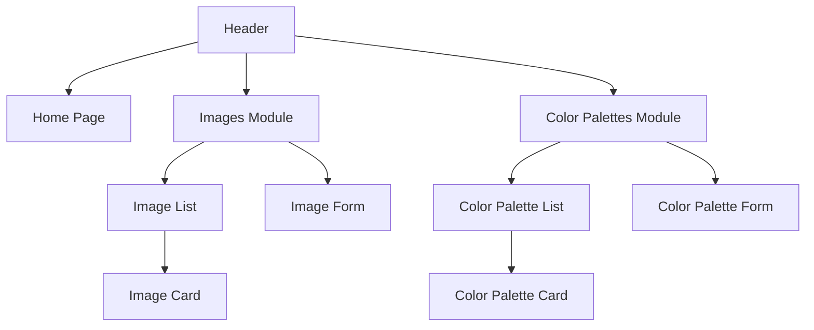
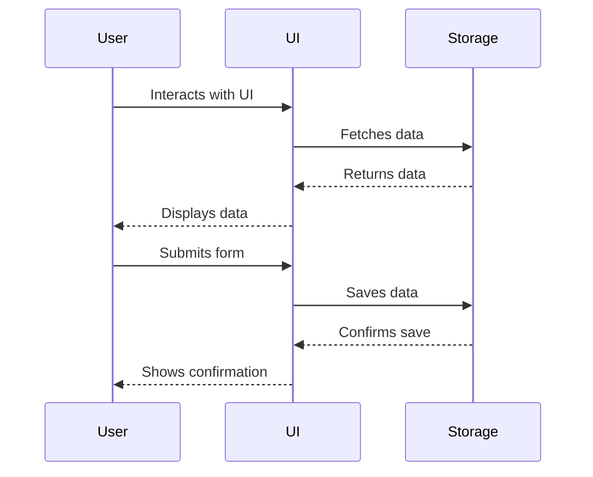
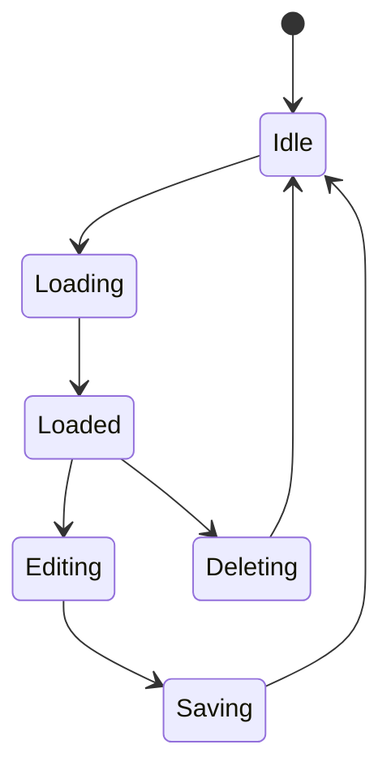

# Image and Color Palette Manager

<!-- TODO: Danger zone para paleta de cores -->

An app to manage images and colors for your marketing or design projects, saving references in a easy and organized way.

<!-- Tell more about the app -->

## Design de Sistema

### 1. Arquitetura Geral

#### Diagrama de Componentes da Aplicação

- **App:** The root component that manages state and renders all other components.
- **Images**

#### Fluxo de Dados entre Componentes

#### Modelo de Estado da Aplicação

